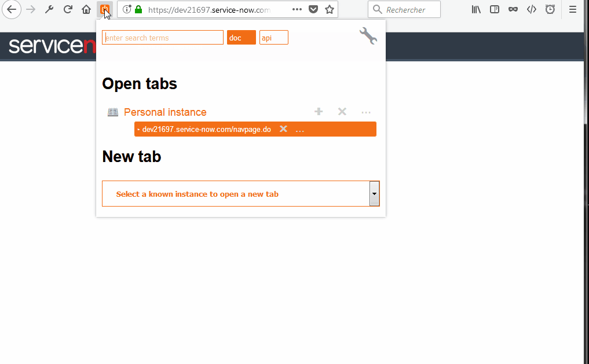
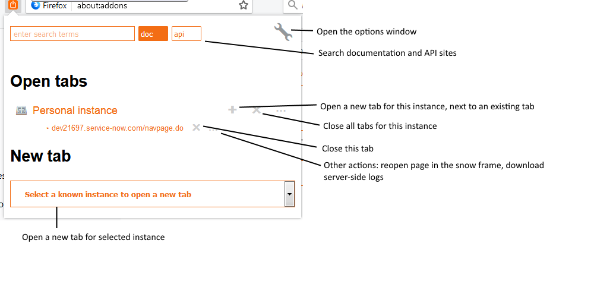

# What is this about

ServiceNow Tool Belt is a set of tools designed to help the ServiceNow administrator or developer in his every day tasks.

<!-- TOC -->

- [What is this about](#what-is-this-about)
- [Install the extension](#install-the-extension)
- [Ok that was easy, now what?](#ok-that-was-easy-now-what)
- [Using the extension](#using-the-extension)
- [Setting a fill color for an instance favicon](#setting-a-fill-color-for-an-instance-favicon)
- [Working with nodes](#working-with-nodes)
- [Tell us what you think](#tell-us-what-you-think)

<!-- /TOC -->

# Install the extension

To install the extension for your browser, just click the links below:
* [addons.firefox.com](https://addons.mozilla.org/fr/firefox/addon/snow-tool-belt/)
* [chrome.google.com](https://chrome.google.com/webstore/detail/servicenow-tool-belt/jflcifhpkilfaomlnikfaaccmpidkmln)

# Ok that was easy, now what?

"Out of the box", the extension will automatically start bookmarking and listing every instances you visit on the service-now.com domain. You can quickly set a friendly name of your choosing via the contextual instance menu.

/!\ **If you are working on non service-now.com instances, make sure you add your filters in the options.
The filters are set in a single field, separated by semicolons.**

If you are working on Firefox, you may want to move the icon in a place that will be more accessible to you, depending on how you are used to work.

# Using the extension

The extension will now automatically save all your instances.
When you click on the browser action icon, it will show you all open tabs on these instances, grouped by instance.

>&#127381; You can now open the browser action popup with the Alt+C shortcut!

# Setting a fill color for an instance favicon

To easily spot the tabs open on any instance, set a color a fill the favicon for this instance. It will keep the original shape of the icon, so if it's a simple square, you will get a simple colored square.

Chrome users do that directly from the extension popup in the contextual menu of the instance. For Firefox and Chrome, you can select a color in the options box.

# Working with nodes

Use the "fetch nodes" contextual menu option to display a list of nodes for this instance.

The extension will fetch the xmlstats.do page for the instance. It will only work if you are logged in an active tab on this instance.

# Tell us what you think

Now, visit [github](https://github.com/macmorning/snowtools-webext/issues) and give us some feedback. Do you have any issue with the extension? What is useful? What is useless? How could it help you more? Want to contribute?...
