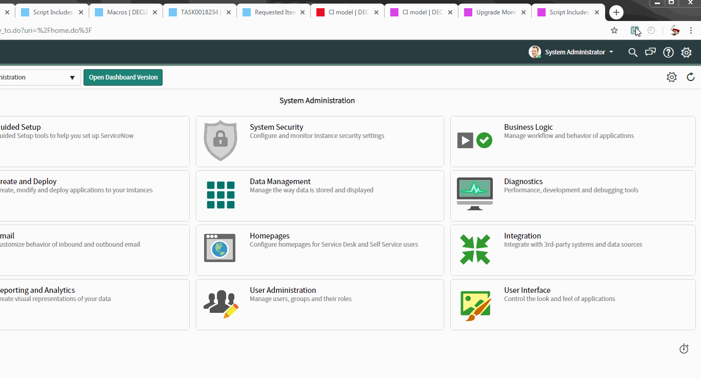
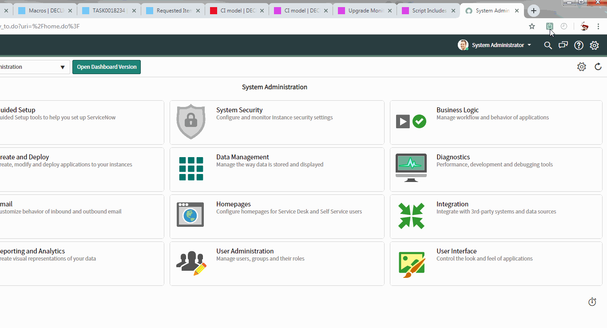
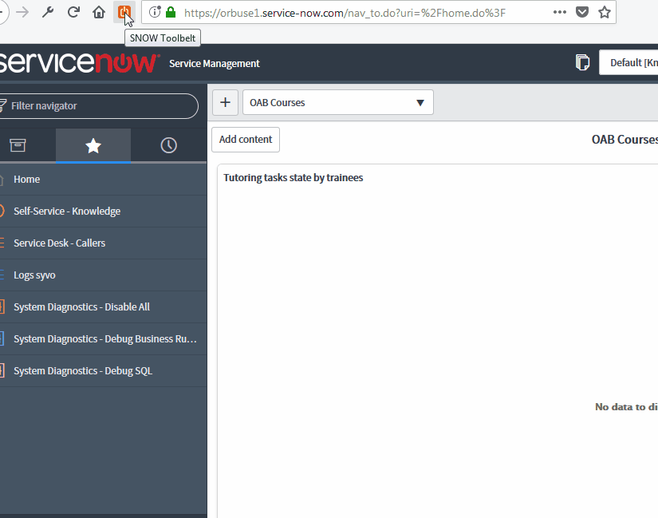

# What is this about

ServiceNow Tool Belt is a set of tools for Firefox and Chrome designed to help the ServiceNow administrator or developer in his every day tasks:
* List open tabs grouped by instance
* Automatically record visited instances 
* Set friendly names for known instances
* Quickly open new tabs on known instances
* Quick access to documentation or API searches, with an autocomplete feature (classes and methods)
* Fetch nodes informations 
* Switch to a specific node (on service-now.com but also on custom domains)
* Reopen the current page in the ServiceNow frame
* Select a color to fill the favicon for each instance
* See the current color set for the instance in the popup
* Use the Alt+C shortcut to quickly access the extension popup
* Hide or show a specific instance from the options page
* Sync your instances & preferences across browser instances
* Export & Import your instances into a json file

{:toc}

# Install the extension

You can download & install the extension for your browser from the store:
* [addons.firefox.com](https://addons.mozilla.org/fr/firefox/addon/snow-tool-belt/)
* [chrome.google.com](https://chrome.google.com/webstore/detail/servicenow-tool-belt/jflcifhpkilfaomlnikfaaccmpidkmln)

# Using the extension

_Out of the box_, the extension will automatically start bookmarking and listing every instances you visit on the service-now.com domain. You can quickly set a friendly name of your choosing via the contextual instance menu.

When you click on the browser action icon, it will show you all open tabs on these instances, grouped by instance.

>&#9888; If you are working on non service-now.com instances, make sure you add your filters in the options. The filters are set in a single field, separated by semicolons.

>&#128161; You can open the browser action popup with the **Alt+C** shortcut by default, but you can customize it in your browser extensions configuration.

# Setting a fill color for an instance favicon

To easily spot the tabs open on any instance, set a color a fill the favicon for this instance. It will keep the original shape of the icon, so if it's a simple square, you will get a simple colored square.

Chrome users can do that directly from the extension popup in the contextual menu of the instance. For Firefox and Chrome, you can select a color in the options box.

# Working with nodes

Use the "fetch nodes" contextual menu option to display a list of nodes for this instance. Select a node to switch to this specific node.

The extension will fetch the xmlstats.do page for the instance. It will only work if you are logged in an active tab on this instance.

>&#9888; If you can't access a node, it may be because it's a backup/admin node that is not usually available from this URL.

# Tell us what you think

Now, visit [github](https://github.com/macmorning/snowtools-webext/issues) and give some feedback. Do you have any issue with the extension? What is useful? What is useless? How could it help you more? Want to contribute?...
